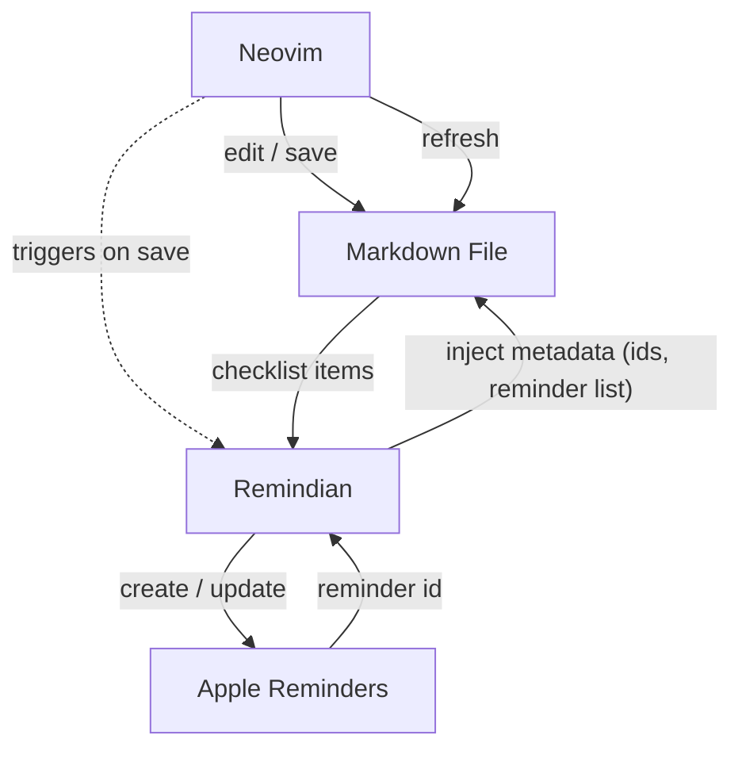

# remindian


Automated reminder manager sourced from Obsidian check lists in neovim.

## Overview

Remindian is a command-line tool that scans markdown files Obsidian in neovim. style checklists and creates reminders in macOS Reminders app for incomplete tasks. It is designed to be used within a neovim environment, leveraging its capabilities to manage notes and tasks efficiently.

## TODO

- [ ] Neovim doc
- [ ] Logging
- [ ] Better notification

## Install

### With Lazy

```lua
  {
    "sledigabel/remindian",
    build = "make dist",
    opts = {
        log_level = 'info',
        filetype = 'markdown',
        reminder_list = 'remindian',
    },
  },
```

## Features

* Parse markdown files for Obsidian checklists
* Identify tasks (e.g., `- [ ] Task`)
* Create or update reminders in macOS Reminders app
* Automatically runs when saving markdown files in Neovim
* Can be manually triggered with the `:RemindianRun` command

## Architecture



Flow:

1. You edit a markdown file in Neovim. On buffer write the Remindian plugin triggers the CLI.
2. Remindian parses checklist style lines and extracts tasks needing reminders.
3. For new or changed tasks it creates / updates entries in Apple Reminders.
4. Apple Reminders returns identifiers and scheduling info.
5. Remindian writes those identifiers (and any updated status/date info) back into the markdown file so future runs stay in sync.
6. Neovim refreshes the updated file with the reminder metadata.

Components:

* Neovim: Where you author and save the markdown checklist.
* Markdown File: Source of truth for task text plus embedded reminder metadata.
* Remindian: CLI + plugin logic that parses, syncs, and annotates.
* Apple Reminders: System store for actual reminder notifications.

## Development

Build the project:

```
make build
```

This will create the binary in the `bin/remindian` location within the plugin directory, which the Neovim plugin will automatically detect and use.

Run the CLI on a markdown file:

```
make run ARGS="path/to/file.md"
```

Run tests:

```
make test
```

Clean build artifacts:

```
make clean
```

## Neovim Plugin Configuration

Configure the plugin in your Neovim config:

```lua
require('remindian').setup({
  enable_logging = false, -- Enable debug logging
  log_level = 'info',     -- Log level (debug, info, warn, error)
  filetype = 'markdown',  -- Default filetype to use for reminders
  reminder_list = 'remindian', -- Default reminder list to use with --list flag
})
```

## Next Steps

* Support completed tasks parsing (- \[x])
* Extract metadata (dates, tags) beyond Obsidian comments
* Map checklist items to reminders
* Schedule and sync with Reminders API
* Provide dedicated examples repository with diverse fixtures
